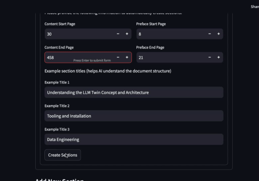
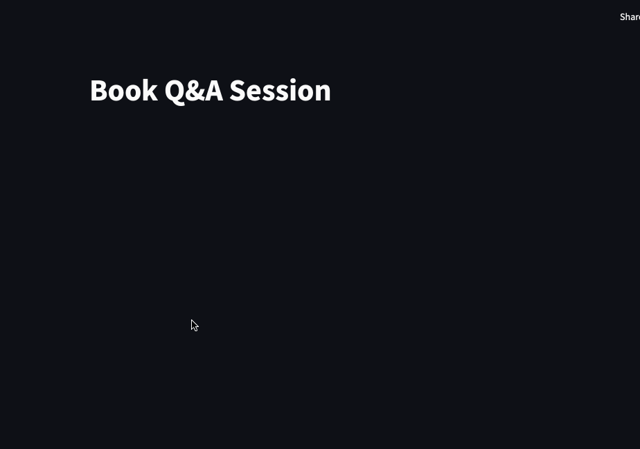

# AI Assistant

An AI-powered tool designed to help users **better learn and remember** reading materials. This project allows you to:
- **Store PDF documents** in a dedicated library.
- **Automatically split a book** into sections (chapters) with the help of AI.
- **Generate questions** for each section to reinforce retention.
- **Chat interactively** with an AI to answer questions, request explanations, and receive feedback on your performance.
- **View session summaries** to assess how well you’ve answered questions and track improvement over time.

---

## Key Features

1. **Document & Section Management**  
   - Upload PDFs and let the AI detect chapters automatically.  
   - Reorder sections or define custom page ranges.  

   **Demo:**  
   

2. **AI-Driven Question Generation**  
   - Generate relevant questions for each section to test understanding.  
   - Edit or remove questions for a more tailored experience.  

   **Demo:**  
   

3. **Interactive Q&A Chat**  
   - Engage in a chat session that recognizes if your messages are answers, explanations, or off-topic.  
   - Receive **real-time feedback** and **session summaries** (accuracy, progress, etc.).  

   **Demo:**  
   

4. **Progress Tracking**  
   - Receive session summaries showing how well you answered questions and your completion rate.

   **Demo:**  
   

## Purpose & Overview

- **Store Documents & Create Sections**  
  Keep all your reading materials in one place, and easily split them into chapters or sections.

- **Generate & Manage Questions**  
  Quickly produce section-specific questions with AI, then refine them for your needs.

- **Engaging Chat Sessions**  
  Discuss each chapter or question in a dynamic chat. The AI determines if you’re providing an answer, asking for an explanation, or off-topic.

- **Progress Tracking**  
  Receive session summaries showing how well you answered questions and your completion rate.

By making reading and studying more interactive through Q&A, this AI Assistant offers an **engaging, memorable learning experience**—helping you retain information effectively.

Happy studying!
